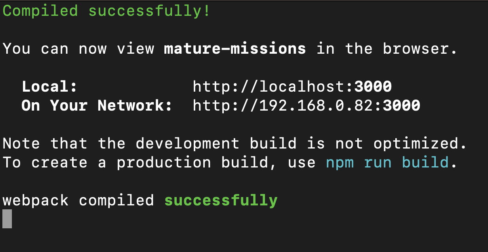

# Mature-Missions-Website (Front-End ONLY)

This repository contains the front-end code and the API specification file `swagger.yaml` for the Mature Missions project.

> **Note:** Backend source code is not included here.

# Used Libraries:
Front-End:
1. axios@1.5.0
2. bootstrap@5.3.1
3. react-bootstrap@2.8.0
4. react-calendar@4.6.0
5. react-datepicker@4.1.1
6. react-dom@18.2.0
7. react-router-dom@6.15.0
8. react-scripts@5.0.1
9. react@18.2.0
10. stripe@14.1.0
11. @stripe/react-stripe-js@2.3.1
12. @stripe/stripe-js@2.1.9
13. @testing-library/jest-dom@5.17.0
14. @testing-library/react@13.4.0
15. @testing-library/user-event@13.5.0

# Working functionalities (Front-End Implementation):
Elderly User:
1. Sign Up
2. Select Subscription
3. View Services
4. Select Service
5. Subscriptions Business Logic
6. Notifications
7. Cancel Service Request
8. Rate Service Request
9. Report Service Request
10. Profile
11. Email and SMS notifications
12. Unsubscribe

Provider User:
1. Sign Up
2. Edit Personal Information
3. Select Services
4. Accept Service Requests
5. View User Information
6. Payment Account Setup
7. Manage Notifications
8. Modify Profile Photo and Information

Admin User:
1. View User List
2. Deactivate Users
3. Manage Payments
4. View Reported Services
5. Notify Providers about Reported Services
6. View and Delete Service Requests

# How to run the application (Front-End)

1. Open a terminal and `cd` into the `mature-missions` (front-end) folder.
2. Run `npm install --legacy-peer-deps` to install all dependencies.
3. Run `npm start` to start the development server.
4. The front-end server should start running and you should see the following output in your terminal:

## API Specification

The `swagger.yaml` file in this root directory documents the API used by the front-end, which I created as part of my work on this project.

> Note: For full functionality, this front-end needs to connect to the back-end services, which are not included in this repository.
